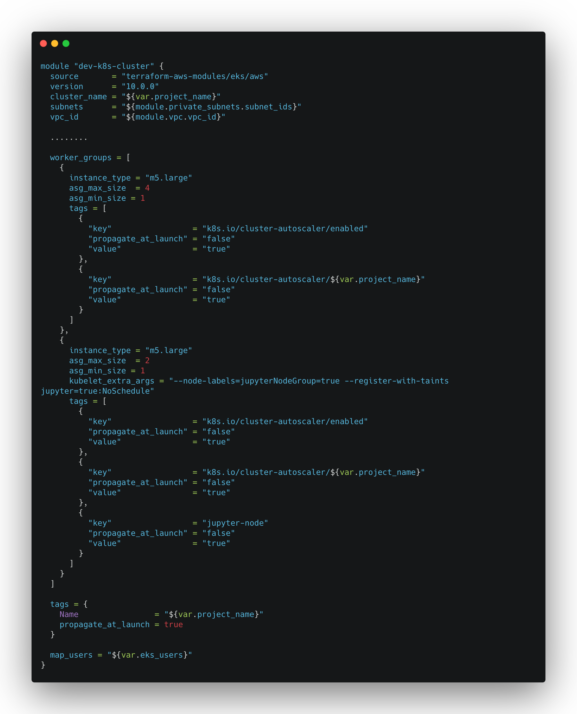

# Deploy on Kubernetes

## Before your start

Naas is not only a python module, it's a set of tools that work perfectly together.

## Naas Tools

Below the set of tools we run to build the perfect notebook experience.


Documentation on how to install them is coming soon.


### [Naas](https://hub.docker.com/r/jupyternaas/naas) 

The magic server who takes care of your notebooks.

### [Proxy](https://hub.docker.com/r/jupyternaas/proxy) 

The proxy who expose the different URL for your notebooks.

### [Notification](https://hub.docker.com/r/jupyternaas/notifications)

The server sending rich email notifications to yourself \(or your audience\).

### [Screenshot](https://hub.docker.com/r/jupyternaas/screenshot)

The server who do HTML screenshots on any website.

### [Jupyter Lab](https://hub.docker.com/r/jupyternaas/lab)

The Jupyter machine who allow users to start their own machine on the cloud.

## Set your local environment


You should set them in your Jupyter config file.


### **Advanced env :**

* `NAAS_RUNNER_PORT` to change the port of the Naas runner
* `PUBLIC_PROXY_API`for API and assets features you should run the Naas proxy machine and provide a hostname.
* `JUPYTERHUB_URL` the web URL of your hub for API and asset features.
* `SCREENSHOT_API` the web URL of your screenshot API for plot and other.
* `NOTIFICATIONS_API` for the notifications feature, you should run the Naas notification machine and provide a hostname.
* `NAAS_SENTRY_DSN` to catch errors made by your users, configure it.
* `SINGLEUSER_PATH` for Kubernetes and your single-user machine have specific hostname end

## 🖥️ Naas in AWS

One of the principal challenge with Naas is that it needs to fit user demands through the day. Hosting it on traditional dedicated servers could not allow Naas to ever happen. We chose to leverage AWS elastic mindset to have an infrastructure that can scale out and scale in when needed.

### Infrastructure Diagram


This design allow us to deploy infrastructure into 3 different locations at the same time. Kubernetes nodes are started as the demand is growing and stopped when single users servers are shutting down.

### Infrastructure as code

We needed a solution to organise the deployment of the infrastructure, doing everything in the console was not a solution as it is very difficult to replicate the changes into different account \(dev, production, ... \).


Terraform was definitely the way to go, we can version our infrastructure into Github and verify what modifications will happen on the infrastructure before actually applying the changes.

Deploying changes is as simple as running:

```bash
terraform plan
terraform apply
```

### Elastic Kubernetes Service

#### EKS Configuration Example



We are using the [kubernetes/autoscaler](https://github.com/kubernetes/autoscaler) with two different worker groups to separate the scaling and deployment of NAAS and Jupyter instances. That way Jupyter instances won't interfer with NAAS deployment.

### EFS - Elastic File System

[EFS](https://aws.amazon.com/efs/) is a service offered by AWS that is simply a NFS managed by AWS. As you might have seen in the diagram, the SFTP server is outside of the kubernetes cluster. As SFTP is part of the ETL, it is necessary that in Jupyter a user is able to see the files he or her send to us through SFTP. EFS allows us to have a shared filesystem between EC2 instances running SFTP and [pods](https://kubernetes.io/docs/concepts/workloads/pods/) into kubernetes.

#### How hard it is to deploy EFS?


### Unleashing RDS

Because databases are critical parts of almsot any infrastructure, we chose to rely on a managed service and did use [RDS](https://aws.amazon.com/rds/) for our PostgreSQL instance. Using this we can focus on building NAAS and not worry about the database anymore.

### A word about security

Because all of this is sensitive, we enforce a strict password policy and the use of MFA \(for console and programatic access\) to every member of our team and we do follow the [Security Best practices in IAM](https://docs.aws.amazon.com/IAM/latest/UserGuide/best-practices.html) encouraged by AWS.

## 🔥 Deployments

So as we saw earlier we are using Terraform to deploy the underlying infrastructure powering Naas, but what about Naas itself. We use multiple tools to manage our deployments.

### Helm

[Helm](https://helm.sh/) allows use to write [charts](https://helm.sh/docs/topics/charts/) that define how our applications \(docker containers mainly\) should work in Kubernetes. It's a very powerful tool and we are deploying everything in our EKS cluster with it. This allows us to version our deployments as well and keep track of every modifications.

### Skaffold

As we have many charts, it can become complicated to deploy them, but also difficult to share values and secrets between charts. [Skaffold](https://skaffold.dev/) allow us to easily create [profiles](https://skaffold.dev/docs/references/yaml/#profiles) for every chart and referencce `values.yaml` and `secrets.yaml`.

For example if we need to deploy a new version of our Jupyter deployment we simply need to run `skaffold deploy -p jupyter` and skaffold will handle everything.

### SOPS

Because storing and deploying secrets can be a difficult part \(I mean if you really want to do it properly and stay safe\) we chose to use [SOPS](https://github.com/mozilla/sops) wrapped by [helm-secrets](https://github.com/zendesk/helm-secrets). SOPS allow us to store our secrets in YAML files and encrypt its content using a [KMS](https://aws.amazon.com/kms/) key in AWS. The wonderful thing about all this is that we simply need to add the right to `encrypt` /`decrypt` to a user to be able to see the secret and modify them. If we want to limit this right to a certain list of users for example we can definitely do it and still store the yams file containing the secrets in the repository, only users with propers right will be able to see its content.

In addition to that, Skaffold is able to handle helm-secrets which means that when we provide a `secrets.yaml` to a Skaffold profile, it will know what to do to decrypt its content.

