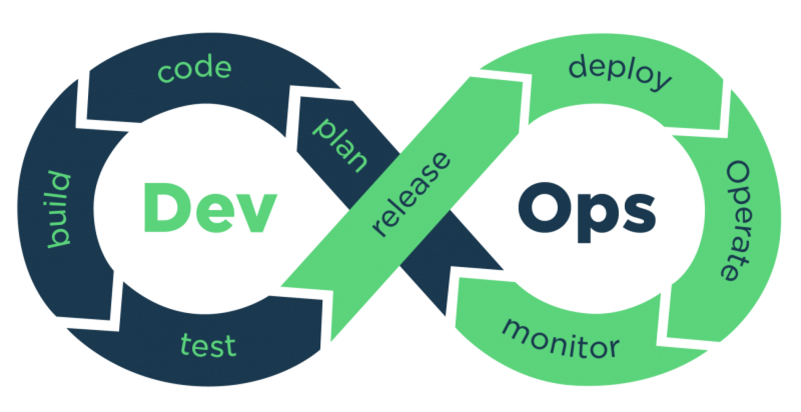

# 🔐 Security

We need to provide you with safe ways to use our services while making sure you keep control over your data.

## Secure channel between you and us

All of our services will make sure you interact with them through a secure channel. This is why every-time, even if you try to connect to one of our products thought HTTP (which is not secure) you will be redirected to a secure version using HTTPS.

HTTPS will ensure that the data flowing between your device and our services will not be seen by others. You can learn more about [Transport Layer Security here](https://en.wikipedia.org/wiki/Transport\_Layer\_Security).

## Libraries / Technologies updates

While we cannot be up to date on everything at every time, we are keeping an eye to new releases of the dependencies/libraries we may use and update them as soon as we can when a new security patch is published.

[Dependabot](https://github.com/dependabot/dependabot-core) is helping us with our own release processes to keep track of new releases and potential [CVE](https://en.wikipedia.org/wiki/Common\_Vulnerabilities\_and\_Exposures) that can be disclosed publicly and may impact our users and infrastructures.

One of the strength of being Open Source is that the code can be audited by anyone, which is no sufficient of course, this is why we plan to work with Pentest/Audit companies to perform a lot of assessments on our services:

* App security
* Network security
* Infrastructure security
* Black box / White box penetration tests
* Security Management

## Releases

For all of our services we are using Git to be able to collaborate internally and with our awesome community. In addition to that Github is of great help to deal with our DevOps needs.

Any modification of the code base goes through a [Github Pull request](https://docs.github.com/en/pull-requests/collaborating-with-pull-requests/proposing-changes-to-your-work-with-pull-requests/about-pull-requests) which allows us to:

* Have the code modifications being reviewed by peers before being applied.
* Run automated tests (Humans are making errors when they need to repeat themselves)
* Run Bugs, Vulneravilities, Security Hotspots, Code Smells scans thanks to [Sonarcloud](https://sonarcloud.io/) and [Snyk](https://snyk.io/).

All of these are helping us build a more secure platform for you to use.

## Access to your account

As you may have noticed, you have multiple ways to authenticate to [app.naas.ai](http://app.naas.ai), the traditional login/password solution which is the most cumbersome and the less secure (So why use it? In 2022, frankly, we don’t know).

You can also connect through your Google / LinkedIn and Github accounts. These three services (and others) are serving millions and millions of users every day so they know a good deal about account security, this is why we prefer to trust them to make your access to naas more secure.

Please do enable [MFA](https://en.wikipedia.org/wiki/Multi-factor\_authentication) on these services to increase the security of your accounts.

## Infrastructure

We chose to trust [AWS](https://aws.amazon.com/) as our cloud hosting provider. AWS allows us to manage our infrastructure with a strong adoption of the Least Privilege Principle at each resource level. This means that in our infrastructure every resource only get the permissions to talks to what she needs to.

If you want to see what kind of super powers AWS is giving us to make your journey with us as safe as possible: [Check this out](https://aws.amazon.com/products/security/)

To manage AWS, we are using [Terraform](https://www.terraform.io/) which allows us to manage our infrastructure through IaC (Infrastructure as Code). Thanks to that we can use all of the DevOps principles:

If you know the source of this image, reach out to us please 🙏

It’s important for us to be able to make sure any updates of the infrastructure can be reviewed and validated before being applied.

## Data

Your data is your gold, and we know that it’s the most important resource you have. This is why every account have it’s own dedicated space / filesystem to store its data.

The access to the data is done through Docker containers on top of Kubernetes (using EKS). This means that you are isolated from other users through a lot of layers.

💡 The most secure offer we have today is the \*\*Enterprise\*\* offer, because in addition to being isolated inside a container, this container is running inside a \*\*dedicated virtual instance\*\*. If you take a look at \[this document about docker security]\(https://docs.docker.com/engine/security/) you will see that the Linux Kernel is part of some attack vectors. For the Kernel we rely on AWS EKS official images and as you have a dedicated instance you have a \*\*dedicated kernel\*\* by choosing the \*\*Enterprise\*\* plan.

You can also choose to keep your data in your data warehouse and use [naas.ai](http://naas.ai) to remotely pilot the **extraction**, **transformation** and **loading** of your data. This would mean that you would use naas.ai to kick off SQL queries, Apache Spark jobs, Apache Airflow DAGs, fire up Hadoop cluster and start jobs on them, etc ...

If you want to transfer data to/from naas and you don’t know how to do it securely or simply need reassurance feel free to contact us, we will help you take the most secure option.
